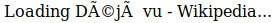
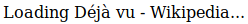

I am generating a [client-side HTML redirect](https://stackoverflow.com/questions/5411538/redirect-from-an-html-page) like this:

changequote(`<<<', `>>>')
include(<<<index_indented.html>>>)

However, I am losing the `charset` meta attribute when I do so.  The output looks like this:

include(<<<example-redirect_indented.html>>>)

This means that my browser is not sure what encoding to use, and does not display the accents correctly.

This, on the other hand, properly shows the accents:

include(<<<desired-output_indented.html>>>)

I've reduced it down as minimal example as I can, and it still occurs.

include(<<<minimal_indented.html>>>)

Here is the output:

include(<<<minimal-output_indented.html>>>)

This occurs in both Firefox 63.0 and Chromium 70.0.

How can I preserve the `charset` attribute of an HTML blob?
